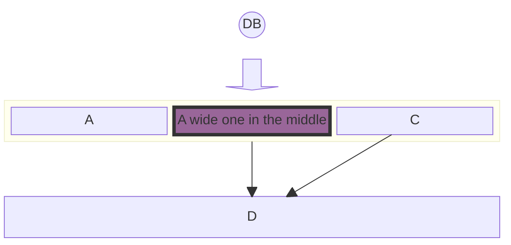

Lorem ipsum dolor sit amet. Sed nemo deleniti *Vel sint sed voluptatem consectetur eos adipisci commodi* est dicta praesentium qui quos dolorem. A dolorem possimus [Est maiores rem obcaecati facere hic veniam sunt a explicabo galisum](https://www.loremipzum.com) ea laboriosam Quis At fugiat dolorem.

Id modi voluptatibus est omnis suntquo saepe qui magnam adipisci aut quasi iste. Et itaque doloremque [Est voluptas id distinctio voluptates et obcaecati enim sed praesentium molestiae](https://www.loremipzum.com) et facere quasi eos quibusdam quia.

Eos nulla porro id quisquam aperiam **Ut repudiandae a fuga dolorem quo dolores omnis id fuga pariatur**. Vel mollitia recusandae non beatae laudantium [Ea voluptatum et galisum dolor eum dolor soluta aut ducimus corporis](https://www.loremipzum.com). Et facere dignissimos eos error errorest voluptas. Sed exercitationem similiqueAut alias sit error iusto eum galisum quasi in totam omnis ut error quia.

- Qui officia nihil At quam saepe hic facere placeat.

- Et repellat autem et error maiores sed repellat cupiditate et inventore sint!

- Et nemo ducimus rem obcaecati provident id voluptatem Quis in labore enim.

- Ea odio quam est omnis aliquam aut iste quia!

- Ad eligendi suscipit quo molestiae accusamus sit internos delectus cum culpa quaerat.

- A odio sint ut accusamus fugit qui blanditiis impedit qui ipsam consectetur?

&nbsp;

<SwmMeta version="3.0.0" repo-id="Z2l0aHViJTNBJTNBcGlsb3RvcyUzQSUzQWRhbmRyZXMwNzc=" repo-name="pilotos">Powered by [Swimm](https://app.swimm.io/)</SwmMeta>
